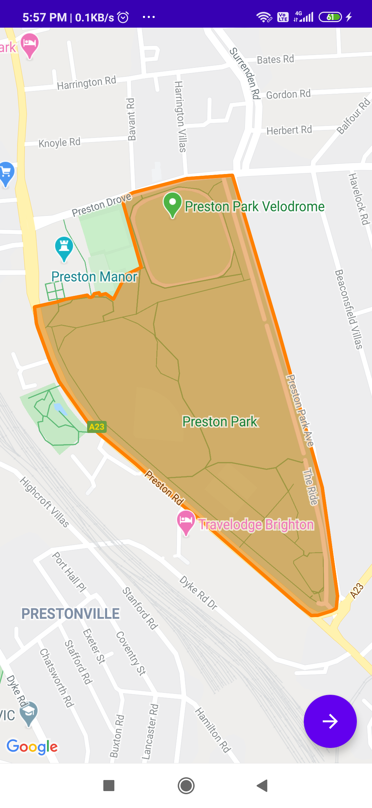
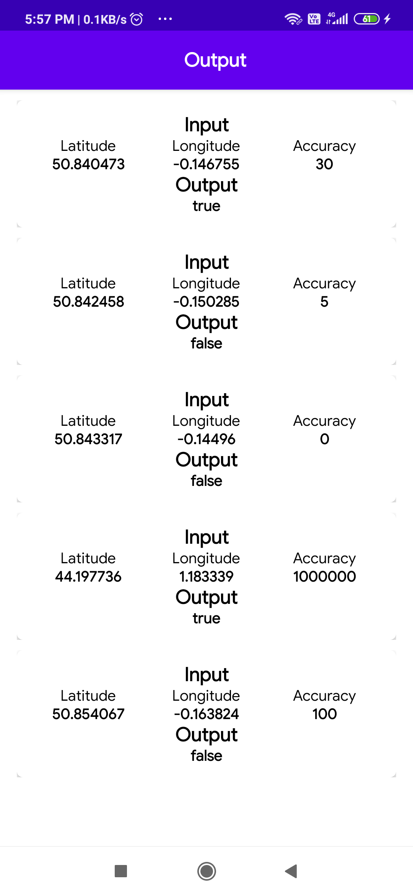

# Location Mapping

**Location Mapping** has provide your location lies within polygon area or outside.Also check through your location with accuracy.

<table style="width:100%">
  <tr>
    <th>Map Page</th>
    <th>Output Page</th>
  </tr>
  <tr>
    <td></td>
    <td></td>
  </tr>
</table>

## About
- It simply loads **Retry json from asset and show all data into Map**.
- Testing User input within geo fence Area or not by using **fun isLocationWithinArea(lat: Double, long: Double, accuracy: Int): Boolean**
- You can Test with other **asset json file change in MapRepository folder getJsonDataFromAsset(context,"hub.json)**.

## Built With 🛠
- [Kotlin](https://kotlinlang.org/) - First class and official programming language for Android development.
- [Coroutines](https://kotlinlang.org/docs/reference/coroutines-overview.html) - For asynchronous and more..
- [Android Architecture Components](https://developer.android.com/topic/libraries/architecture) - Collection of libraries that help you design robust, testable, and maintainable apps.
- [LiveData](https://developer.android.com/topic/libraries/architecture/livedata) - Data objects that notify views when the underlying database changes.
- [ViewModel](https://developer.android.com/topic/libraries/architecture/viewmodel) - Stores UI-related data that isn't destroyed on UI changes.
- [Koin](https://start.insert-koin.io/) - Dependency Injection Framework (Kotlin)
- [Material Components for Android](https://github.com/material-components/material-components-android) - Modular and customizable Material Design UI components for Android

# Project Structure

    com.sunil.googlemapping    # Package

    ├── model               # Model classes
    ├── repository          # Repository to handle data from asset file.
    ├── di                  # Dependency Injection
    |
    ├── ui                  # Activity/View layer
    │                       # Activity,ViewModeland RecyclerView Adapters.
    |
    ├── utils               # Utility Classes / Kotlin extensions

## If any query,suggestion and doubt please contact me with
Email Id :  **sunildb21@gmail.com**
 

